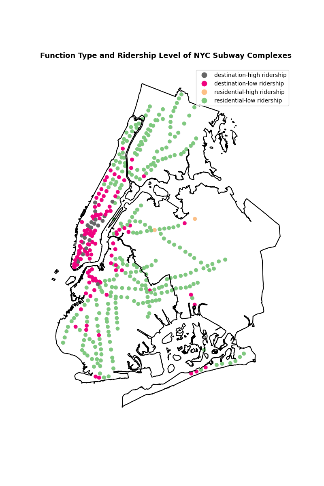

# NYC Subway Origin Destination Analysis

## Introduction
The NYC subway network has thousands of possible trips one can take. The number of connections between all of the 454 stations is truly staggering. Given the size of the network it may seem like the exact ridership for each origin-destination pair is an unknowable concept. Additionally, if we only have data on where someone entered the system, how do we know where they ended up? Atter all, users only swipe in to enter the system -- not when they leave. Nevertheless, thanks to the wonderful Data & Analytics team team at the MTA we can have "pretty good estimates" of these values. In their blog post "[Introducing the Subway Origin-Destination Ridership dataset](https://new.mta.info/article/introducing-subway-origin-destination-ridership-dataset)" they explain their methodology for getting daily and hourly estimates of ridership between *each and every* origin-destination pair in the system. Amazingly impressive stuff! 

In this project, I use the origin-destination [open dataset](https://data.ny.gov/browse?tags=origin-destination) that they created to better understand the nature of NYC subway stations (technically they're "complexes", stations for one line that are tightly connected to stations of another line (e.g.: the G and L and Metropolitan/Lorimer)). Specifically, I cluster the stations based on their total ridership and their destination type. In each case, I break out the ridership into different times of day: Rush Hour AM, midday, weekend, etc. In the total ridership case, I simply sum up the ridership for each interval. On the other hand, for the destination type case, I get the proportion of origin or destination trips that fall into a certain time interval for each station. I then compare that ridership interval proportion to the average for the entire system. For example, the average station sees 16% of all of their trip origins happen during the weekend. At Beford Avenue on the L, 24% of all trip origins happen on the weekend giving Bedford Avenue's weekend origin ridership ratio as 0.06. In other words, Bedford Avenue has relatively more weekend demand than other stations in the subway.

## Data Preparation
The Origin-Destination dataset provides the typical ridership between each pair of stations for each day and hour of the week. This is done monthly. As an example, a single row will show the Monday ridership at 9 AM between Grand Central and Times Square. In this project, I find the total ridership *from* a station to get the total origin ridership and the ridership *to* a station in order to get the destination ridership. Additionally, I average the data for each month to get the average 2024 ridership by day and hour for each station. 

To prep the data for clustering, I find the time intervals for each hour and group the data by that. For the total ridership clustering, no further changes are made. For the destination type clustering, I find the origin and destination interval ratio, as described above. 

## Clustering Details
Before clustering the data, I use the [clustergram](https://clustergram.readthedocs.io/en/stable/) library to determine the optimal number of clusters for each clustering type. In both cases, two clusters were best. The silhouette score showed that the ridership axis had a clearer difference than the destination type axis (scores of 0.8 versus 0.4, respectively). Next, I use K-means clustering on each axis separately. 

## Results
For each axis two major clusters emerged: high ridership versus low ridership and residential versus destinations. Along the ridership axis, for each time interval, high ridership stations have around 11 times more ridership than low ridership stations. Definitely a clear difference between the two! The destination type differences were primarily in Rush Hour ridership, in particular Rush Hour PM: there was a 13% difference in the relative ridership levels during this time (destinations were -0.1 and residential complexes were 0.03). In other words, a lower proportion of people are going to destination complexes at the end of a typical work day than are going to residential complexes.

The final results can be viewed here: 

Unsuprisingly, the destinations are closer to the Central Business District whereas the residential complexes are away from the center. The exceptions simply prove the validity of this fact, such as Mets/Willets Pt and 161 St - Yankee Stadium being some of the few examples very far from the center. Moreover, one can see a huge class imbalance in the clusters: two thirds of the complexes are "residential-low ridership" and only **2** complexes are "residential-high ridership". 

## Future Work
Classifying complexes based on ridership patters is only one of hundreds of different ways one can use the Origin-Destination dataset. I hope you enjoy working with the data as much as I did!